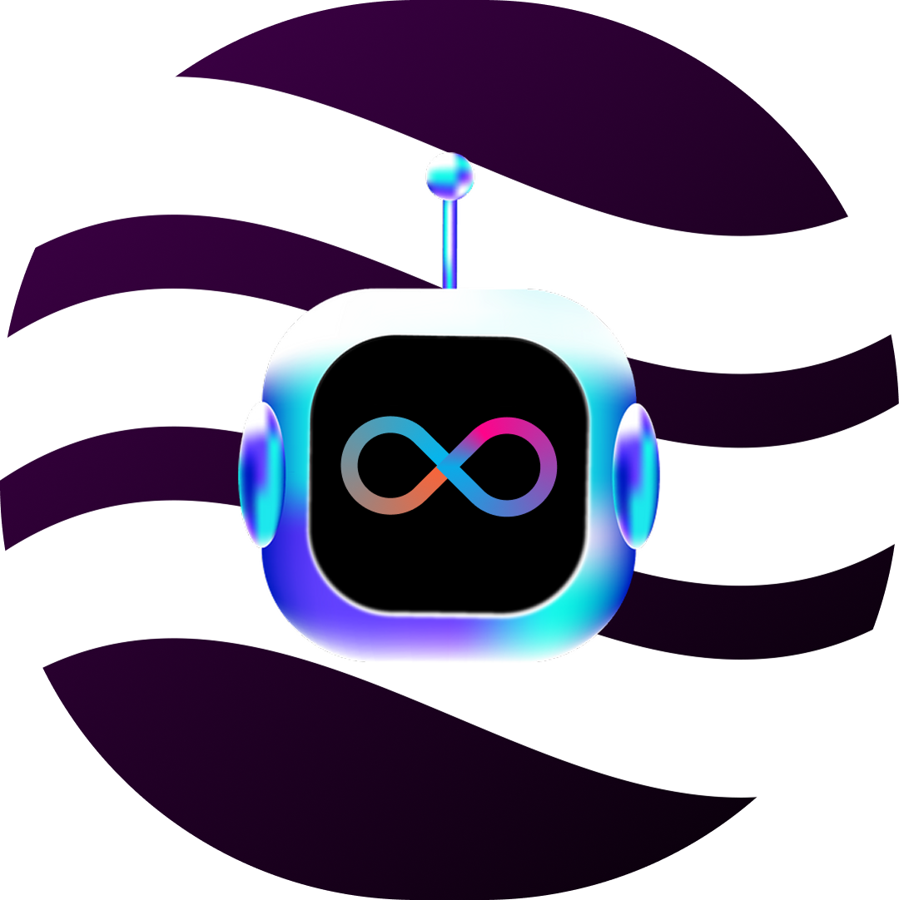

# Smart3 - Learn, Build, and Grow in Web3 with AI-powered Hands-on Labs.

## Introdution
Smart3 is an AI-powered platform that combines interactive learning and hands-on practice to empower professionals in the Web3 ecosystem. Through gamified tracks, quizzes, and sandbox labs, users learn about blockchain, DAOs, and DeFi while gaining real-world experience.  

Additionally, Smart3 connects skilled talent with market opportunities, aligning acquired knowledge with real demands from Web3 startups and companies. Our mission is to accelerate careers and drive Web3 adoption through practical and accessible education.

## Features  
- **Interactive and hands-on learning** – Gamified educational tracks on Web3 and AI.  
- **Sandbox labs** – Experiment with smart contracts, DAOs, and DeFi in a secure environment.  
- **Quizzes and challenges** – Validate knowledge through gamification mechanics.  
- **Market connection** – Talent pool and job opportunities for Web3 professionals.
- **Agent AI** - Learning Agent AI
- 
## Team Members
This project was designed and developed by students from Inteli – Institute of Technology and Leadership:
- [Davi Duarte](https://github.com/Yuhtin)
- [Leunam Sousa de Jesus](https://github.com/leeunam)
- [Pedro Jorge Alves Soares](https://github.com/PedroJorgeSA)
- [Rafael Josué](https://github.com/J05UE-l)
- [Victor Garcia Dos Santos](https://github.com/CryptoVictor)

## Special Thanks
A special thanks to the organizing team of the ICP AI Agents Hackathon and to the ICP EU Alliance for this incredible opportunity. We are excited to contribute to the Internet Computer Protocol ecosystem and push the boundaries of AI and Web3 innovation. 
